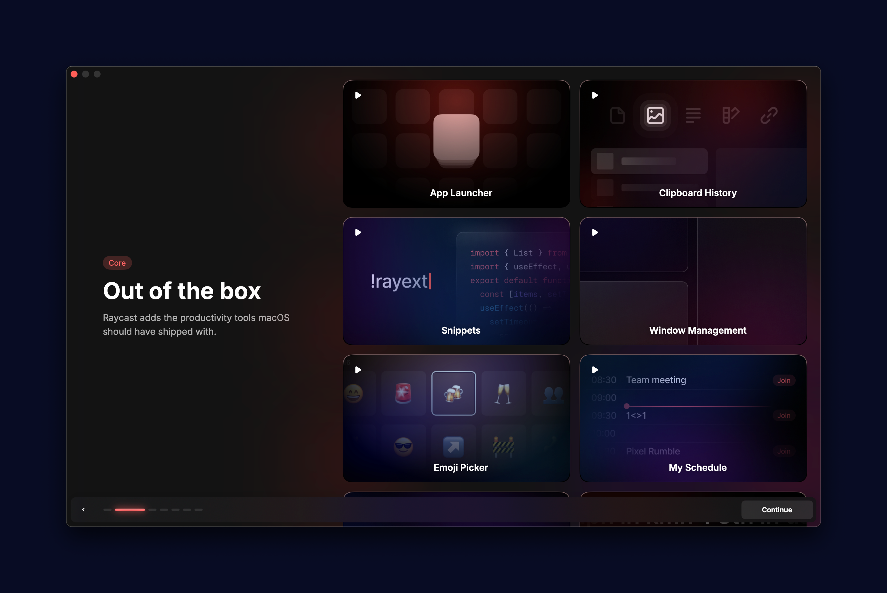
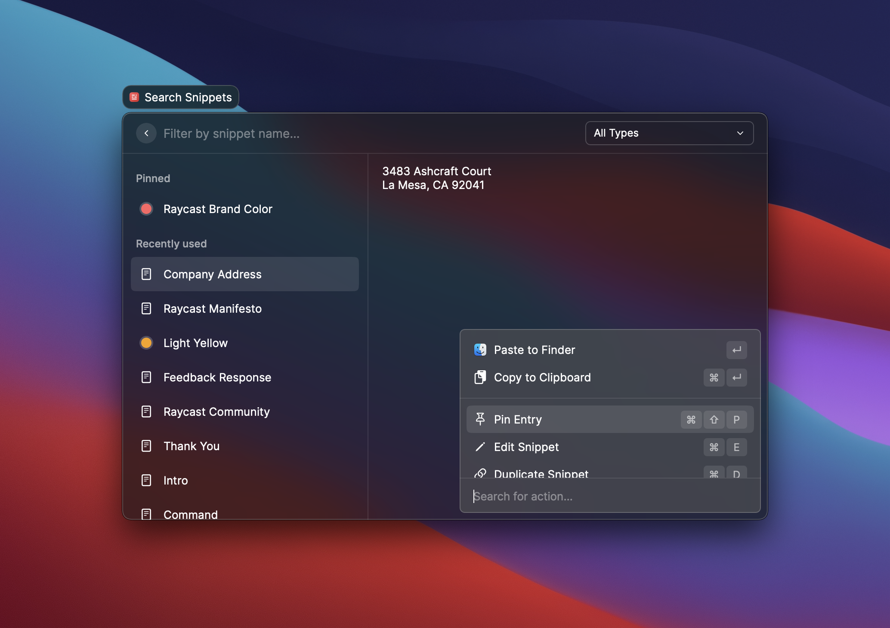
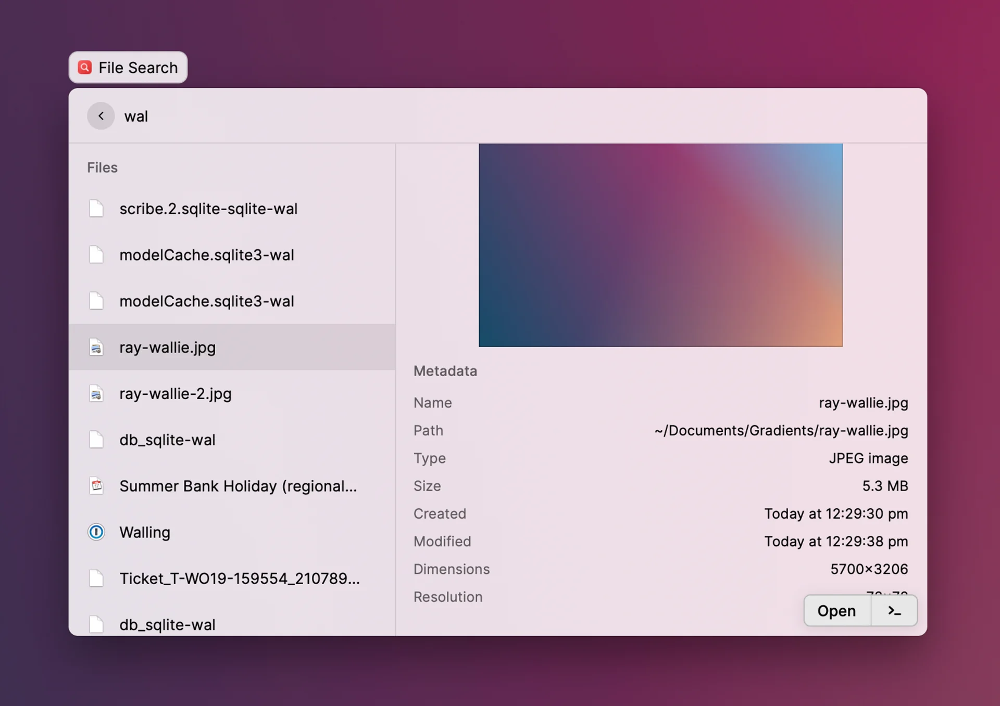

## **What is a Launcher and Why Do I Need It?**

In the fast-paced digital world, **efficiency is key**. As someone who spends a significant amount of time on a Mac and who is always looking to optimize my workflow, I’ve always been on the lookout for tools that streamline my workflow and reduce friction. This is where **launchers** come into play. A launcher is essentially a command bar that allows you to quickly access apps, files, and perform various tasks using just your keyboard. Think of it as a powerful, customizable version of Spotlight, but with far more capabilities.

**Raycast**, in particular, is a modern take on the classic launcher concept, much like Alfred but with a more contemporary twist. While Alfred has been a go-to for many, Raycast brings a fresh perspective, blending sleek design with powerful features that make it an **indispensable tool** for anyone looking to enhance their productivity.

## **The Main Features of Raycast**

Raycast offers a range of features that are incredibly useful, and the best part is that many of these are available for free. Here are some of the key functionalities that this tool has to offer to newcomers.

- **Snippets**: One of the features I rely on most frequently is Snippets. This functionality enables me to conveniently store and swiftly insert blocks of text, code, or commonly used phrases. It proves invaluable for streamlining repetitive typing tasks. Primarily, I leverage it for managing various email addresses across work, school, and the ubiquitous spam account. By employing shortcuts like '!spam' or even incorporating my prettierrc configuration as a snippet, I enhance efficiency and streamline my workflow seamlessly. 

- **Clipboard History**: Raycast's clipboard history feature is a game-changer, offering users a seamless way to access a wide variety of previously copied items, including text within images. In the Pro tier, users enjoy unlimited history storage, ensuring easy retrieval of any copied content. However, the Free tier provides ample clipboard history storage for most users. Let's face it, how often do we really need to revisit something we copied over a week ago? These features alone would make Raycast a strong contender in the world of productivity tools, but it doesn’t stop there. 

## **The Raycast Store and Community Extensions**

One of the standout aspects of Raycast is its thriving community and the extensive collection of extensions available in the Raycast Store. It’s amazing to see how the community has embraced the platform, developing extensions that cater to almost every need imaginable.
For example:

- **GitHub Extensions**: Perfect for developers, allowing quick access to repositories, issues, and pull requests without leaving the command bar.

- **Jira Extensions**: Ideal for project managers, enabling efficient task and project management directly from Raycast.

- **Notion Integration**: For those who live in Notion, this extension makes it easy to search and navigate your workspace.

The store is constantly growing, with new extensions being added regularly. Whether you need a tool for project management, code review, or even just a weather forecast, chances are there’s an extension for it. This level of community involvement not only enhances the versatility of Raycast but also ensures that the tool evolves in line with user needs.

## **Building Extensions: Easier Than You Think**

If you have experience in web development and are familiar with TypeScript (TSX), you’ll find that building your own Raycast extensions is surprisingly straightforward. The platform is designed to be developer-friendly, with comprehensive documentation and an active community that’s always willing to help.

Creating custom extensions allows you to tailor Raycast even further to your specific needs, making it not just a tool you use, but a tool that’s uniquely yours. This extensibility is one of Raycast’s most powerful features, and it’s incredibly rewarding to see your own tools in action, seamlessly integrated into your workflow.

## **AI Features and Paid Options**

Raycast also offers a suite of AI-powered features that take the platform to the next level. One of the most notable is the **AI Chat with Presets**. This feature allows you to integrate AI-driven chat capabilities directly into your workflow, complete with customizable presets for different tasks. Whether you need to draft an email, summarize a document, or brainstorm ideas, the AI chat is there to assist, making it a valuable tool for anyone who relies on creative or analytical work.

While many of Raycast’s features are free, there are also premium options available that unlock additional functionality. These paid features are well worth considering if you find yourself relying heavily on Raycast for your daily tasks, as they can further enhance your productivity and streamline your workflow.

## **Conclusion**

Raycast has quickly become an essential part of my daily routine. From its core features like Snippets and Window Management to the expansive world of community-built extensions, it’s a tool that adapts to my needs and grows with my workflow. Whether you’re a developer, project manager, or just someone looking to get more done in less time, Raycast offers something for everyone.

If you’re serious about productivity and you’re on a Mac, I highly recommend giving Raycast a try. With its blend of free features, powerful extensions, and cutting-edge AI capabilities, it’s more than just a launcher—it’s the **ultimate productivity companion**.
